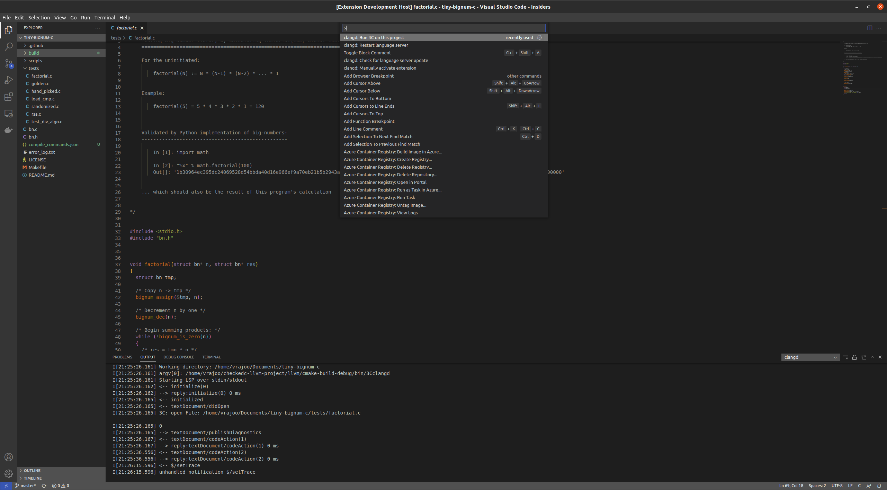
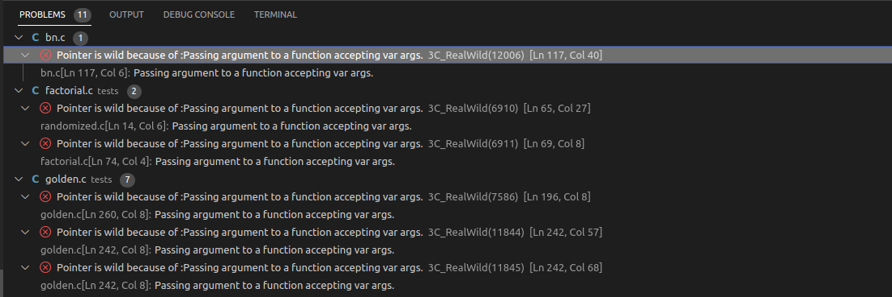

# Using the Extension

After setting up the editor and the extension. Open up VSCode and open your project by pressing `Ctrl+K & Ctrl+O` and selecting your project folder. Make sure your project has a compile database as mentioned earlier(`compile_commands.json`).

##  Starting the Conversion Process

Once you open up the project, just navigate to the first seen **C file** so that the `3Cclangd` server starts up. Once the server starts up, head to the command palette using `Ctrl+Shift+P`. A pop-up on Top-Center appears to give you choices for commands to run. 

<figcaption align = "center"><b>Command Palette in Action</b></figcaption>

Try to search for `Run 3C on this project`, run the command which will start the conversion process on your project. Depending on the size of the project, the conversion might take anywhere from 5-15 seconds to finish. The info boxes on the bottom right will serve as a guide to the progress of the conversion.

##  Root Causes and Diagnostics

Unlike traditional code editor language extensions, `3clsp` uses diagnostics as a means to report the root causes in your project. **Root Causes** refer to pointers or code segments that *3c* was unable to annotate due to various reasons like unsafe casts, variable arguments etc. Each root cause in your project will be displayed in problems tab on the bottom left of the editor window.

These root causes consist of the pointer that is Wild (Not Checked or Unsafe) and the code segment that is responsible for it being Wild.

<figcaption align = "center"><b>Diagnostics Window</b></figcaption>

##  Code Actions and Solving Root Causes

The great thing about root causes is that they can be fixed without the need of huge refactoring of the original code. We use code actions, a feature provided by VSCode to solve these root causes that were reported by our tool.

Simple head over to one of the diagnostics and look for the swiggly lines in your code. You might notice a light bulb next to it. These are actions for that specific diagnostic.

### Making Pointers Non-Wild

Once you press the light bulb, you are presented with two options. First `Make this pointer non-Wild and apply the observation everwhere`, this option makes sure that the pointer is made non-wild and make all the pointers that are wild due to the same reason non-Wild too. This option is generally safer if you have a good grip on what your project is coded like. But most times it's safer to convert these pointers one by one. This can be done by choosing the second option `Make ONLY this pointer non-WILD`.

After selecting any one of these options, the tool will again rewrite your file but this time the aforementioned pointer would be safe or Checked. You might need to go through every one of the diagnostics and choose for yourself wheter the pointer you are about to declare is safe is indeed spatially safe. Most of the times our tool will mark a pointer as WILD because it it unsure how how the pointer is used in the project. Only the developer and the mangers have a handle on how to handle these cases.

